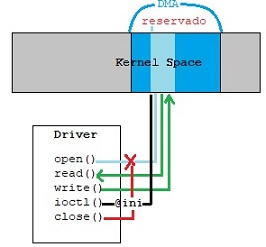

## Sistemas empotrados II Shared_Memory

- **Isak Edo**
- **Dariel Figueredo**

## Introducción
En una placa Zedboard de Xilinx se esta utilizando el módulo **openAMP** para que uno de los cores del SoC ejecute una aplicación bare metal. Este módulo crea un canal de comunicación con el objetivo de transmitir datos desde el core en bare metal hasta el core ejecutando un linux. Sin embargo, aparecían anomalías en la transmisión.

Como solución se propone el uso de un driver para el core linux que realice una reserva de memoria compartida para ambos core en la SRAM compartida y provea de una interfaz para su uso. Este driver permite que las comunicaciones entre los cores sean asíncronas.

Mediante este driver el linux puede leer de la memoria compartida según vaya escribiendo la aplicación en bare metal. Además, puede leer la dirección donde empieza el espacio reservado para así poder enviársela al core en bare metal y que este pueda escribir.  

## Entorno de trabajo

La placa sobre la que se va a programar dicho driver es una **Zedboard** de Xilinx con Zynq®-7000 SoC programable, el cual incluye Dual ARM® Cortex™-A9 MPCore. Estos cores comparten una memoria DDR3 de 512MB fuera del SoC, esta es la que se va a utilizar para su comunicación.

El va a utilizar el sistema operativo para empotrados **Petalinux**, el cual se compilará e instalará el boot y sistema de ficheros en un tarjeta SD. Para ello se utilizan las **Petalinux Tools** proporcionadas por Xilinx, así como el **Board Support Package** propio de la Zedboard para no tener que definir el hardware de la FPGA.

Además, para el desarrollo de la aplicación de bare metal se utiliza el IDE de programación XSDK basado en eclipse, el cual permite generar el fichero .elf. Tanto la aplicación en linux como el módulo se programan en un editor de texto, mientras que para el módulo se realiza cross compiling con el compilador **arm-xilinx-linux-gnueabu-gcc**.

Para poder hacer que un core ejecute una aplicación en bare metal mientras que el otro core esta en linux es necesario utilizar el módulo de Xilinx **openAMP**. Mediante este módulo se desvincula uno de los cores del linux y se ejecuta la aplicación en bare metal como esclavo del core linux que hace las veces de master.

Para poder comunicar ambos cores se utiliza el módulo **rpmsg_user_dev_driver**, el cual es un driver para un canal de comunicación entre los dos cores. De este modo el maestro en linux puede enviar mensajes al core en bare metal. Este core captura el mensaje como un evento y mediante una función se puede ejecutar código como respuesta.

Este canal a su vez utiliza un buffer reservado como memoria compartida para realizar la transmisión de los datos de un lado a otro. Tiene un límite de 512B bytes reservados, desglosándose en 16B de cabecera y 496 bytes de payload. En la información del módulo se aconseja no cambiar el tamaño del mensaje porque puede dejar de funcionar.

## Driver

Establece un área de memoria, reservada por dma, compartida entre los núcleos para cumplir la función de canal de comunicaciones.

### Resumen funcionamiento del driver

La llamada open, además de devolver el descriptor, reserva memoria para DMA y esta es liberada en el proceso de close. Las llamas read/write transfieren datos sobre la memoria reservada leyendo y escribiendo entre 'kernel_space' y 'user_space'. Finalmente la llamada ioctl permite conocer la dirección física de inicio del espacio reservado.



### Sobre las direcciones físicas y virtuales

La dirección que devuelve ioctl es una dirección real dentro del espacio de "memoria físico" del sistema, dado que está pensada para que se le pase dicha dirección a una aplicación bare-metal. En dicho proceso es necesario, además de asegurar que es una dirección directamente mapeada, retirar el offset presente de base "PAGE_OFFSET. Para cumplir esta  se ha recurrido al macro ```__pa()```.

```c

	init_addr_pa = (off_t)__pa(init_addr_va);

```


### Funciones

```c
static struct file_operations shared_memory_smops=
{
	.read = dev_read,
	.write = dev_write,
	.open = dev_open,
	.release = dev_release,
	.unlocked_ioctl = dev_ioctl,
};
 dev_open(struct inode *inodep, struct file *filep);
 dev_release(struct inode *inodep, struct file *filep);
 dev_read(struct file *filep, char *buffer, size_t len, loff_t *offset);
 dev_write(struct file *filep, char *buffer, size_t len, loff_t *offset);
 dev_ioctl(struct file *filep, unsigned int cmd, unsigned long arg);
```

##### dev_open:

La función `dev_open`  se encarga de reservar la memoria compartida. Es importante llamar a close(dev_release) para liberar dicha memoria.

Se utiliza `kmalloc` con la opción `__GFP_DMA` para reservar el espacio de memoria necesario. Inicialmente se reservan 4KB, hasta el máximo permitido de 16MB. En caso de fallar la función devuelve -1.

##### dev_release:

La función `dev_release` es llamada en el proceso de 'close' y se encarga de liberar el espacio de memoria reservado utilizando `kfree`.

##### dev_read:

La función `dev_read` encapsula la lectura del contenido almacenado en la memoria compartida.

Los datos a leer deben ser copiados del 'kernel space' al 'user_space' para lo cual se utiliza la función copy_to_user que simplifica el proceso. Por otro lado se requieren los parámetros usuales en este tipo de operación: un buffer destino para almacenar los datos leídos y el número de bytes a leer. En cualquier caso se verifica que no se exceda el número de bytes reservados en la lectura, si falla devuelve -1.  

##### dev_write:

La función `dev_write` encapsula la escritura de los datos a la memoria compartida.

Los bytes a escribir en la memoria reservada deben ser copiados de 'user_space' a 'kernel_space' para esto se utiliza la función copy_from_user. La función requiere un buffer con los datos, y el número de bytes a escribir. En cualquier caso se verifica que no se exceda el número de bytes reservados en la escritura, y si falla devuelve -1.

##### dev_ioctl:

La función `dev_ioctl` se utiliza para comunicarse más allá del simple read/write. En este caso se utiliza para informar de la dirección de inicio de la zona reservada.

## Pruebas

Para poder comprobar el correcto funcionamiento del driver se han programado como test una aplicación para linux y una aplicación para el bare metal. La aplicación bare metal puede recibir tres tipos de mensajes distintos, WRITE indicando que escriba en la memoria compartida, ECHO para comprobar que funciona correctamente el canal devuelve el mensaje recibido al core linux, y finalmente SHUTDOWN para apagar el core.

Por otro lado la aplicación en linux provee una interfaz de texto sencilla con la siguientes opciones: enviar un mensaje al bare metal para que escriba en la memoria compartida, escribir el propio linux a través del driver en la memoria compartida, leer la memoria compartida, realizar un ping al bare metal y apagar el core remoto.
